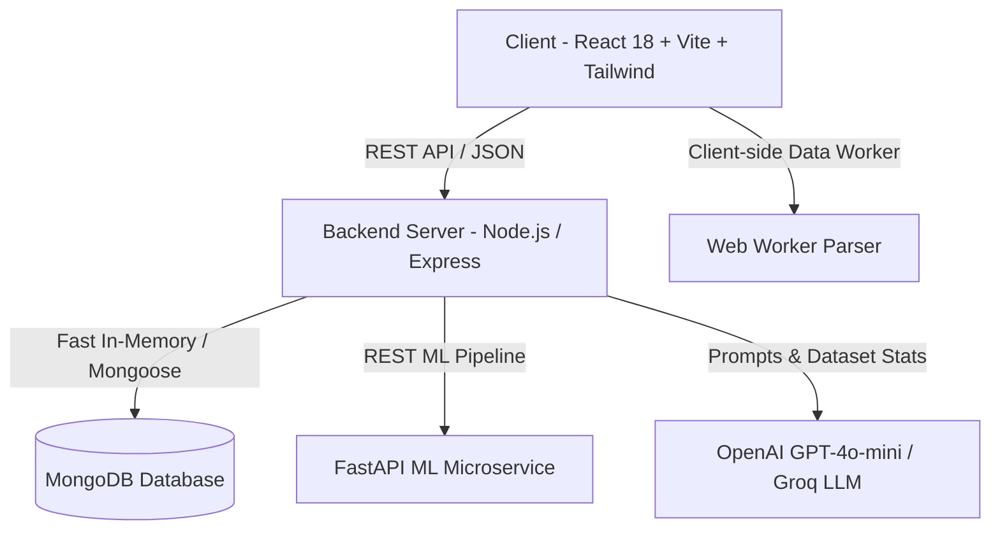

# 🚀 Datalytics AI — Intelligent Data Analytics & Automated Machine Learning Platform

<div align="center">

[](https://reactjs.org/)
[](https://nodejs.org/)
[](https://fastapi.tiangolo.com/)
[](https://openai.com/)
[](https://tailwindcss.com/)
[](https://vitejs.dev/)
[](https://opensource.org/licenses/MIT)

**An end-to-end modern data science platform that turns raw CSV datasets into actionable business intelligence, predictive ML models, interactive charts, and executive reports in minutes — powered by Eighteen AI.**

[Explore Features](#-key-features) • [Quick Start](#-quick-start) • [Architecture](#-system-architecture) • [API Reference](#-api-endpoints) • [Tech Stack](#-technology-stack)

</div>

---

## 🌟 Overview

**Datalytics AI** bridges the gap between raw data and executive decision-making. Whether you are a business analyst, data scientist, or product manager, Datalytics empowers you to upload tabular datasets, explore deep statistical insights, train optimized Machine Learning models (Classification & Regression), generate executive-ready PDF reports, and chat directly with your dataset using an intelligent AI copilot.

---

## ✨ Key Features

### 1. 📁 Instant Data Ingestion & Smart Profiling
- Seamless **drag-and-drop CSV upload** with auto-schema detection.
- Fast Web Worker parsing for large datasets without UI thread blocking.
- Interactive data table with sorting, filtering, pagination, and column type inference.

### 2. 🔍 Automated Exploratory Data Analysis (EDA)
- Comprehensive missing value audits, duplicate detection, and outlier identification.
- Summary statistics (Mean, Median, Standard Deviation, Skewness, Kurtosis, Quartiles).
- Correlation matrices and distribution analysis across numeric & categorical features.

### 3. 📊 High-Performance Interactive Visualizations
- Powered by **Plotly.js** with real-time responsive rendering.
- Scatter plots, distribution histograms, heatmaps, box plots, and multi-variable charts.
- Dark-mode glassmorphic charts with instant PNG/SVG export capabilities.

### 4. 🤖 Automated Machine Learning (AutoML) & Predictions
- **Supervised ML:** Automatic dataset preprocessing, feature encoding, scaling, and training for both **Regression** (Linear, Ridge, Random Forest, XGBoost) and **Classification** (Logistic Regression, Random Forest, Gradient Boosting).
- Metric evaluation cards (RMSE, R², MAE, Accuracy, F1 Score, Precision, Recall, Confusion Matrices, ROC curves).
- **Unsupervised Learning:** K-Means clustering and PCA dimensionality reduction.
- Live single-record and batch **Prediction Sandbox**.

### 5. 💬 Eighteen AI — Intelligent Dataset Copilot
- **Mode 1: Dataset Chat** — Natural language Q&A about rows, columns, averages, top performers, and trends.
- **Mode 2: AI Insights** — Unsupervised pattern detection, anomaly highlighting, and correlation analysis.
- **Mode 3: Decision Engine** — Actionable strategic recommendations tailored to your dataset statistics.
- Full conversation history persistence and markdown-rendered responses.

### 6. 📄 Executive PDF Reports & Decision Engine
- One-click automated **C-Suite Report Generation**.
- Structured executive summaries, risk matrices, strategic growth opportunities, and statistical deep dives.
- Downloadable PDF reports formatted with custom styling and charts.

### 7. 💳 User Management & Credit System
- Secure JWT authentication with **Google OAuth 2.0** support.
- Integrated **Razorpay Payment Gateway** for purchasing analysis credits.
- MongoDB persistent storage with zero-config in-memory fallback.

---

## 🏗️ System Architecture



---

## 🛠️ Technology Stack

| Layer | Technologies |
|---|---|
| **Frontend** | React 18, Vite 6, Tailwind CSS, Lucide React, Plotly.js, Axios, React Icons |
| **Backend API** | Node.js, Express.js, JWT, Multer, Razorpay SDK, Dotenv |
| **ML Engine** | Python 3.10+, FastAPI, Scikit-learn, Pandas, NumPy, Uvicorn |
| **AI / LLM** | OpenAI API (`gpt-4o-mini`), Groq API fallback |
| **Database** | MongoDB (Mongoose) + High-performance In-Memory Session Store |

---

## 🚀 Quick Start

### Prerequisites
- **Node.js**: `v18.x` or higher
- **npm**: `v9.x` or higher
- **Python**: `3.10+` (optional, for ML microservice)
- **Git**

---

### 1. Clone the Repository

```bash
git clone https://github.com/sangamsingh18/datalytics-lite.git
cd datalytics-lite
```

---

### 2. Configure Environment Variables

Create a `.env` file in the `server/` directory:

```bash
# server/.env
PORT=8000
NODE_ENV=development

# Database
MONGODB_URI=mongodb://localhost:27017/datalytics

# Security
JWT_SECRET=your-super-secret-jwt-key

# AI Provider (OpenAI or Groq)
OPEN_AI_KEY=your_openai_api_key_here
OPENAI_MODEL=gpt-4o-mini

# Google Auth (Optional)
GOOGLE_CLIENT_ID=your_google_client_id

# Razorpay (Optional for Payments)
RAZORPAY_KEY_ID=your_razorpay_key_id
RAZORPAY_KEY_SECRET=your_razorpay_key_secret

# ML Microservice URL
ML_SERVICE_URL=http://127.0.0.1:8001
```

---

### 3. Install Dependencies & Run

#### 🟢 Step A: Start the Backend Server (Port 8000)
```bash
cd server
npm install
npm start
```

#### 🟢 Step B: Start the Frontend App (Port 5000)
Open a new terminal:
```bash
cd client
npm install
npm run dev
```

#### 🟢 Step C: Start the Python ML Service (Port 8001) *(Optional)*
Open a new terminal:
```bash
cd server/ml-service
pip install -r requirements.txt
python -m uvicorn app.main:app --host 127.0.0.1 --port 8001
```

---

## 🌐 Application URLs

| Service | URL | Description |
|---|---|---|
| **Frontend UI** | [http://localhost:5000](http://localhost:5000) | Interactive user interface |
| **Backend API** | [http://localhost:8000](http://localhost:8000) | Express REST API server |
| **ML Service** | [http://localhost:8001](http://localhost:8001) | Python FastAPI training service |

---

## 📡 API Endpoints Summary

### 🤖 Chat & AI Copilot
| Method | Endpoint | Description |
|---|---|---|
| `POST` | `/api/chat` | Main conversational assistant with dataset context |
| `POST` | `/api/chat/ai-insights` | Deep patterns and anomaly detection |
| `POST` | `/api/chat/recommendations` | Strategic executive business decisions |
| `GET` | `/api/chat/history` | Retrieve session chat history |
| `DELETE`| `/api/chat/clear` | Clear conversation history |
| `GET` | `/api/chat/health` | Check configured LLM provider status |

### 📊 Dataset & Analytics
| Method | Endpoint | Description |
|---|---|---|
| `POST` | `/api/dataset/upload` | Upload CSV dataset file |
| `POST` | `/api/exploration/profile` | Generate full statistical EDA report |
| `POST` | `/api/visualization/plot` | Generate Plotly-compatible chart figures |
| `POST` | `/api/prediction/train` | Train regression/classification ML models |
| `POST` | `/api/prediction/predict` | Run inference with trained model |

---

## 📁 Project Structure

```
datalytics-lite/
├── client/                     # Frontend Application (React + Vite)
│   ├── src/
│   │   ├── components/         # Reusable UI & Chatbot components
│   │   ├── features/           # Modular steps: Dataset, Exploration, ML, Visuals, Reports
│   │   ├── hooks/              # Custom React hooks (useDataset, useToast)
│   │   ├── services/           # Axios API client configuration
│   │   └── utils/              # Client-side data helpers & workers
│   └── package.json
│
├── server/                     # Backend API (Node.js + Express)
│   ├── config/                 # DB configuration & environment settings
│   ├── controllers/            # Request handlers (Chat, Dataset, Prediction, EDA)
│   ├── middlewares/            # Auth, Session, Upload middlewares
│   ├── routes/                 # Express API routes
│   ├── services/               # Core business logic & AI orchestration
│   ├── ml-service/             # Python FastAPI Machine Learning microservice
│   └── server.js               # Entry point
│
├── .gitignore                  # Git ignore rules for safety & clean builds
└── README.md                   # Project documentation
```

---

## 🔒 Security & Best Practices

- **Zero API Key Leakage**: Keys are read strictly from server-side environment variables.
- **Fail-Safe Fallbacks**: If MongoDB or OpenAI connection drops, the platform gracefully switches to in-memory storage and smart statistical fallbacks.
- **Session-Isolated Analysis**: Each uploaded dataset is scoped to an encrypted session token.

---

## 🤝 Contributing

Contributions, issues, and feature requests are welcome!

1. Fork the Project
2. Create your Feature Branch (`git checkout -b feature/AmazingFeature`)
3. Commit your Changes (`git commit -m 'Add some AmazingFeature'`)
4. Push to the Branch (`git push origin feature/AmazingFeature`)
5. Open a Pull Request

---

## 📄 License

This project is licensed under the **MIT License** — see the [LICENSE](LICENSE) file for details.

---

<div align="center">
Built with ❤️ by <b>Sangam Singh</b>
</div>
